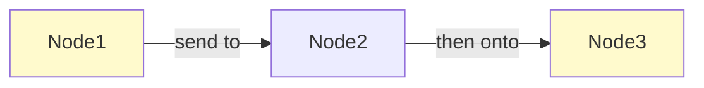

# Mermaid

This is a sample **mermaid.js** diagram:

```mermaid
graph LR
    A[Node1]:::flagger -- send to --> B[Node2]
    B -- then onto --> C[Node3]:::datadog
    classDef flagger fill:#FFFACD
    classDef datadog fill:#FFFACD
```
